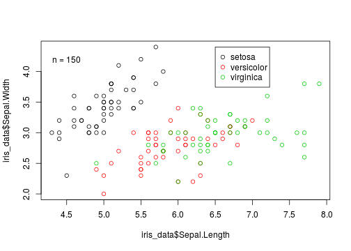

## Chargement des données ##

On charge un exemple de données:


```r
dat  <- iris
```

- **Iris** est un jeu de données intégré dans R (parfait pour des exemples)
- Aprés avoir chargé un jeu de données, on fait quoi ?

---
## Chargement des données ##

Vérification de la structure:

```r
str(dat)
```

```
## 'data.frame':	150 obs. of  5 variables:
##  $ Sepal.Length: num  5.1 4.9 4.7 4.6 5 5.4 4.6 5 4.4 4.9 ...
##  $ Sepal.Width : num  3.5 3 3.2 3.1 3.6 3.9 3.4 3.4 2.9 3.1 ...
##  $ Petal.Length: num  1.4 1.4 1.3 1.5 1.4 1.7 1.4 1.5 1.4 1.5 ...
##  $ Petal.Width : num  0.2 0.2 0.2 0.2 0.2 0.4 0.3 0.2 0.2 0.1 ...
##  $ Species     : Factor w/ 3 levels "setosa","versicolor",..: 1 1 1 1 1 1 1 1 1 1 ...
```

---
## Chargement des données ##

À quoi ces données ressemblent?


```r
head(dat)
```

```
##   Sepal.Length Sepal.Width Petal.Length Petal.Width Species
## 1          5.1         3.5          1.4         0.2  setosa
## 2          4.9         3.0          1.4         0.2  setosa
## 3          4.7         3.2          1.3         0.2  setosa
## 4          4.6         3.1          1.5         0.2  setosa
## 5          5.0         3.6          1.4         0.2  setosa
## 6          5.4         3.9          1.7         0.4  setosa
```

---  Visualiser les données

## Visualiser les données ##

On peut mettre en relation deux variables quantitatives avec la fonction  `plot()`


```r
plot(x=dat$Sepal.Length,y=dat$Sepal.Width)
```


---  Visualiser les données

## Visualiser les données ##

Ou tout mettre en relation...


```r
plot(dat)
```



**ATTENTION:** Il y a des bonnes et des mauvaises facons de représenter des données... 

---  Visualiser les données

## Visualiser les données ##

Pour mettre en relation une variable qualitative avec une variable quantitative, on utilise généralement la fonction `boxplot()`
    

```r
boxplot(Sepal.Length ~ Species, data=dat)
```


    

- Test


```r
plot(dat)
```


